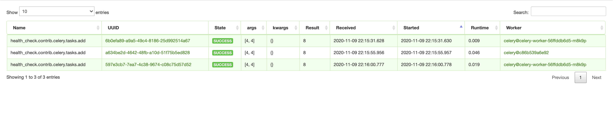

# Celery 주의사항
> celery를 rabbitMQ, Docker, k8s로 실행할 때 주의해야할 사항들을 정리합니다.

1. superuser privileges warning 처리
2. 외부 서버로 rabbitMQ를 설정 해두었고, broker와 result_backend에 대해서 rabbitMQ를 설정해두었지만, 아무리 공식문서를 찾아봐도 **rabbitMQ에 대해서 result_backend를 지원하는 문서가 존재하지 않았다.**

- 기존 환경 설정
```python
### RabbitMQ
RABBITMQ_URL = "amqp://{user}:{password}@{host}:{port}".format(
    user=os.getenv('RABBITMQ_USER'),
    password=os.getenv('RABBITMQ_PASSWORD'),
    host=os.getenv('RABBITMQ_HOST'),
    port=os.getenv('RABBITMQ_PORT'),
)

CELERY_BROKER_URL = RABBITMQ_URL
CELERY_RESULT_BACKEND = RABBITMQ_URL # 이 부분이 문제
```


- `$ celery -A con_item worked -l info` 명령어 실행 결과 로그


애써 무시했던 warning들 .. 

```bash
/usr/local/lib/python3.8/site-packages/celery/platforms.py:800: RuntimeWarning: You're running the worker with superuser privileges: this is
absolutely not recommended!   

Please specify a different user using the --uid option.

User information: uid=0 euid=0 gid=0 egid=0

  warnings.warn(RuntimeWarning(ROOT_DISCOURAGED.format(
/usr/local/lib/python3.8/site-packages/celery/backends/amqp.py:65: CPendingDeprecationWarning:
    The AMQP result backend is scheduled for deprecation in     version 4.0 and removal in version v5.0.     Please use RPC backend or a persistent backend.

```

## running-the-worker-with-superuser-privileges-root
> [공식문서](https://docs.celeryproject.org/en/latest/userguide/daemonizing.html#running-the-worker-with-superuser-privileges-root)

```bash
/usr/local/lib/python3.8/site-packages/celery/platforms.py:800: RuntimeWarning: You're running the worker with superuser privileges: this is
absolutely not recommended!   

Please specify a different user using the --uid option.

User information: uid=0 euid=0 gid=0 egid=0
```

기본적으로 celery는 `By default Celery won’t run workers as root.` 이지만, Dockerfile로 celery를 빌드하면 기본적으로 root 권한을 가지게 됩니다. 
(루트 권한을 가지게 되면 pickle 때문에 큰 문제가 생긴다고 하지만, 정확하게 어떤 부분이 very dangerous한지는 모르겠다.) 

비로 아래와 같이 warning이 뜨지만, celery는 기본적으로 pickle이 not enabled이기 때문에 무시해도 괜찮을 경고문 같지만 불안하니 해결을 하자면 간단하게 다음 명령으로 해결됩니다.

```bash
$ celery -A con_item worked -l info --uid=nobody --gid=nogroup
```


저의 프로젝트는 systemd나 supervisord와 같은 기술을 사용해 셀러리를 데몬하지 않고, k8s의 pod로 관리하기 때문에 셀러리의 `/etc/default/celeryd` conf로 인해 생성되는 
`CELERYD_LOG_FILE="/var/log/celery/%n%I.log"`, `CELERYD_PID_FILE="/var/run/celery/%n.pid"` 파일을 따로 생성해주지 않아도 되기 때문에 이렇게만 하더라도 `permission denied`는 생기지 않습니다.


## `result_backend`
> [공식문서](https://docs.celeryproject.org/en/stable/userguide/configuration.html#result-backend)

*The backend used to store task results (tombstones)*라는 공식 문서를 읽어보면 results를 저장하기 위해 사용한다 되어 있습니다. 

즉 celery task를 저장하기 위해 사용하는데, 해당 설정이 동작하는지 간단하게 확인하는 방법은 flower에서 /task에 Result란이 있는지 확인 하면 됩니다.



celery 5.x 기준으로 amqp는 더이상 사용하지 말 것을 권유합니다.

- [`rpc://` 코드](https://github.com/celery/celery/blob/a3c377474ab1109a26de5169066a4fae0d30524b/celery/backends/rpc.py)
- [`amqp://` 코드](https://github.com/celery/celery/blob/a3c377474ab1109a26de5169066a4fae0d30524b/celery/backends/amqp.py)
  - deprecated 4.x, removed 5.x 라고 명시되어있다.


> Do not use `amqp://` for celery result_backend [링크](https://stackoverflow.com/a/48921731)
>> 정리를 하자면, 클라이언트 연결이 4개 존재하고 각 연결을 100개의 task를 produce한다고 하면 amqp는 총 400개의 unique queues를 생성해 각 result를 저장하지만, `rpc://`의 경우에는 4 queues(1 per client)를 생성하고 각 큐에 100 results를 저장한다고 한다. 

**정리를 하자면 result_backend 로 amqp://는 사용하지 말아야 한다.**

